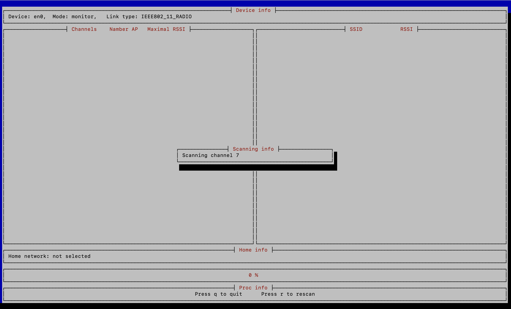

# Wifi noise analyzer
Helper for choice wifi channel.

The radio air is full of radio sources, so when setting up a home wireless network, it is useful to know how many access points there are nearby, their power and the number on each radio channel. 
The task that this project solves is the determination of the least filled Wi-Fi channel on band 2.4 Ghz.  
To solve this problem, the following actions are performed:
1. Searches for Wi-Fi devices and checks if they support monitor mode or set data link type with radio data and provides a list of devices (maybe several) to choose from:

2. Attempt to establish a connection with the capture of radio data. It is sometimes possible to capture radio data in promiscouos or normal modes.
3. Scanning wifi channels to determine ssid and their signal strength:
   - automatic discovery of supported DLTs and  set it;
   - automatic channel switching from 1 to 13 and their sequential scanning (if channel not supported it is being ignored);
      * for mac os used module on swift and core wlan lib;
      * for linux used module on c and ioctl mechanism.

4. Exclude from home network scan data, it is possible to select any found network or select &lt;&lt;None&gt;&gt;:

5. Display for each channel the number of WiFi access points and the maximum signal level.

You can move around and monitor the signal strength of your home network and the number of access points on any channel.